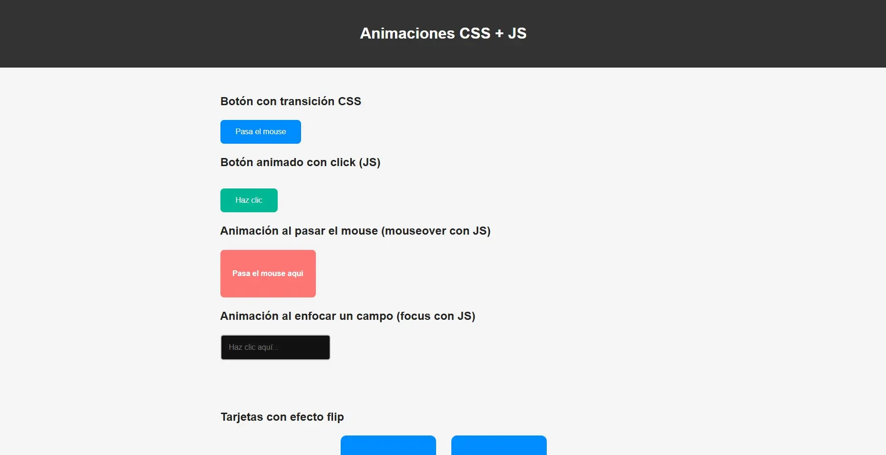

# 🎬 Animaciones CSS + JS | Proyecto Web



**Autor:** Sergio Silva  
**Repositorio:** [sergiosilva-dev/animaciones-css-js](https://github.com/sergiosilva-dev/animaciones-css-js)  
**Demo en vivo:** [Ver proyecto en GitHub Pages](https://sergiosilva-dev.github.io/animaciones-css-js/)

---

## 📌 Descripción

Este proyecto es un ejercicio práctico de aprendizaje enfocado en animaciones web utilizando **CSS** y **JavaScript**, combinando transiciones, keyframes, eventos del DOM y efectos modernos de interfaz.

Incluye prácticas reales de desarrollo profesional:
- Accesibilidad
- Responsive design
- SEO técnico avanzado
- Buenas prácticas de estructura y documentación

---

## 🎯 Objetivos del proyecto

- Dominar el uso de `@keyframes`, `transition` y `transform`
- Aplicar animaciones controladas con JS (`click`, `focus`, `scroll`, `hover`)
- Practicar `IntersectionObserver` y `requestAnimationFrame`
- Construir un sitio web accesible, semántico y optimizado

---

## 🧠 Tecnologías utilizadas

| Tecnología   | Propósito                                 |
|--------------|--------------------------------------------|
| `HTML5`      | Estructura semántica                      |
| `CSS3`       | Estilos y animaciones (`keyframes`, `transition`) |
| `JavaScript` | Eventos DOM, animaciones por script       |
| `IntersectionObserver` | Animaciones al hacer scroll      |
| `requestAnimationFrame`| Movimiento animado con control   |

---

## 🎨 Animaciones implementadas

- ✅ Entrada animada con `@keyframes` al título principal
- ✅ Botón con rebote al hacer clic (`click`)
- ✅ Cuadro que reacciona al `mouseover`
- ✅ Input con animación `focus`
- ✅ Cuadro con efecto `zoom`
- ✅ Ícono girando infinitamente
- ✅ Footer animado con retardo
- ✅ Cuadro animado con `requestAnimationFrame`
- ✅ Tarjetas con efecto flip
- ✅ Animaciones al hacer scroll

---

## 🚀 Cómo usar el proyecto

1. Clona este repositorio:

```bash
git clone https://github.com/sergiosilva-dev/animaciones-css-js.git
cd animaciones-css-js
```

2. Abre el archivo `index.html` en tu navegador.  
No necesitas servidor: es un proyecto 100% frontend.

---

## 📱 Responsive y accesibilidad

- ✅ **Diseño adaptado a móviles**
- ✅ **Colores contrastados**
- ✅ **Navegación por teclado** (`tabindex`)
- ✅ **Etiquetas `aria-label`** en elementos interactivos
- ✅ **Imágenes con `alt`**

---

## 🔍 SEO Técnico Avanzado

Este proyecto incluye:

- 🏷️ `meta` SEO general (`description`, `keywords`, `author`, `robots`)
- 🧠 Open Graph + Twitter Card para redes sociales
- 📦 `favicon.ico` + íconos Apple/Android + `site.webmanifest` (PWA básico)
- 🗺️ `sitemap.xml` + `robots.txt` para indexación por buscadores
- 🧾 Datos estructurados (`JSON-LD`) con `WebSite` y `Person`
- 📊 Integración con Google Search Console y Google Analytics
- 🚀 Lazy loading de imágenes y uso de `defer` en scripts
- ✅ Validación con Lighthouse y W3C

---

## 📂 Estructura del proyecto

```
animaciones-css-js/
├── index.html
├── css/
│   └── style.css
├── js/
│   └── main.js
├── assets/
│   ├── icons/
│   │   └── [favicons, manifest]
│   └── preview.png
├── sitemap.xml
├── robots.txt
└── CHANGELOG.md
```

---

## 📄 Licencia

Este proyecto está bajo la [licencia **MIT**](LICENSE).  
© 2025 Sergio Silva

---

## 💬 Contacto

- GitHub: [https://github.com/sergiosilva-dev](https://github.com/sergiosilva-dev)
- LinkedIn: [https://www.linkedin.com/in/sergiosilva-dev](https://www.linkedin.com/in/sergiosilva-dev)
- Correo: **sergiosilvadev@gmail.com**
- Web personal: próximamente... 🚧

---

> Proyecto creado con enfoque educativo, técnico y profesional para portafolio, posicionamiento y aprendizaje continuo 🚀
